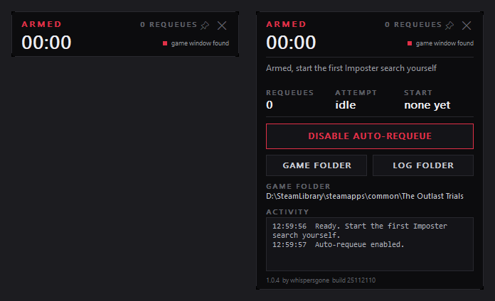

# Outlast Requeue

Restarts an Invasion search in The Outlast Trials after the game's own
matchmaking ticket times out. It never changes the foreground window, never
moves your cursor, never uses global input, and touches no game file.



Created by whispersgone. Version 1.0.4, Windows x64.

The application is a small floating widget. Collapsed, it shows the state,
the search timer, and the requeue count; rest the pointer on it to open the
full panel, pin it to keep it open, drag it anywhere. When a match is found
it counts down ten seconds, then minimizes and stops floating.

## The problem

When you queue as Imposter and the server times the ticket out, the game stops
searching and drops you back to the Trial Board. If you are not watching the
screen, the queue is simply dead until you notice.

Outlast Requeue watches the game's own log, recognises the timeout for the
exact ticket it armed, and presses START again from the background. Then it
waits for the game to confirm that a new ticket actually exists.

## How it works

The application reads `%LOCALAPPDATA%\OPP\Saved\Logs\OPP.log`, the log the
game already writes, and tracks one Invasion ticket at a time:

1. You select Imposter and start the first search yourself. The application
   sees the `context=invasion` search event and arms that exact ticket ID. The
   board remembers your selection, so nothing else ever has to be chosen.
2. When a `type=timed_out` event arrives for that same ticket, it lets the
   client finish handling the timeout, posts `Tab` to the game window, and
   waits for the game to log that the Trial Board is accepting input. If the
   board was already open, the first `Tab` closes it, the log says so, and it
   is opened again.
3. It captures the game client in the background, locates the START bar in
   that capture, and posts a mouse click at it. The game drops mouse messages
   while it believes it is in the background, so it is first told that it is
   active with the same messages Windows would post, and told the opposite
   right after the click. Which window is in the foreground never changes.
4. A new Invasion ticket has to appear in the log within 25 seconds. If it does
   not, the sequence is repeated, up to three attempts on that one ticket, and
   then the application waits for you.

Both the key and the click go to one specific window: the visible
`UnrealWindow` whose process image matches the executable inside the game
folder it discovered.

## Requirements

| Item | Value |
| --- | --- |
| Game | The Outlast Trials on Steam, App ID `1304930` |
| Last verified game build | `25112110` |
| System | Windows x64 |

Nothing is installed into the game folder. The application does not refuse to
run on a newer Steam build; it depends only on the game's log records and on
the Trial Board layout.

## Use

Download the Windows archive, extract it, and run `Outlast Requeue.exe`. Start
the game, enter the Sleep Room, enable auto-requeue, then open the Terminal,
select Imposter, and start the first search yourself. Closing the window with
the title-bar X exits the application completely. There is no tray icon and
nothing keeps running in the background.

`Outlast Requeue.exe --diagnostics` prints what the application discovers,
including the START position it detects while the Trial Board is open.

Full instructions and troubleshooting are in
[packaging/windows/README.md](packaging/windows/README.md).

## Safety boundaries

Outlast Requeue:

- never modifies, adds, or removes game files;
- never changes which window is in the foreground;
- never uses global keyboard or mouse input;
- never moves the pointer;
- never changes fullscreen, borderless, resolution, or display settings;
- never retries without a new matching timeout and ticket confirmation;
- never sends a delayed action after its short safe timing window expires;
- never installs a background service or automatic-start entry.

The build checks these claims. `tests/audit_windows_binary.sh` reads the
compiled binary's import table and fails if it finds any foreground,
global-input, cursor, or display-mode API. The same names are rejected in the
source.

## Building

Install a MinGW-w64 x86-64 toolchain, then:

```bash
make -C src/windows clean all
```

The result is `build/windows/OutlastRequeue.exe`, a GUI-subsystem PE64 that
needs no separate runtime. The state engine has its own test suite:

```bash
make -C tests clean check
```

See [BUILDING.md](BUILDING.md) for release archives.
